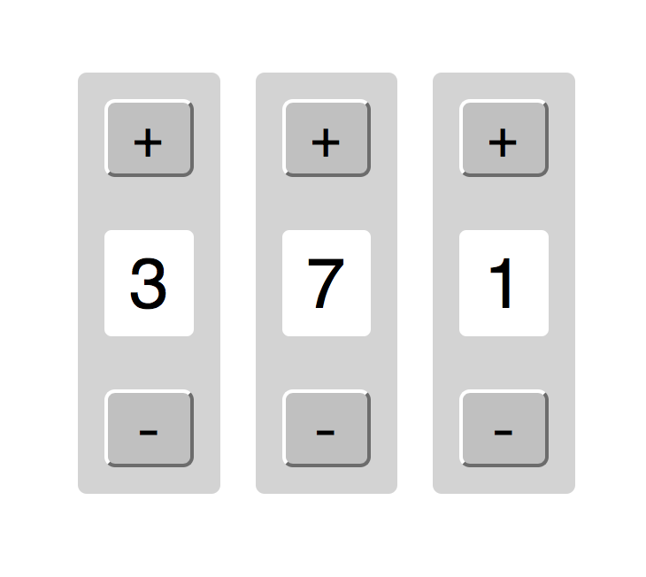

# Intro

In React, different sections of your app are separated into parts called "components". You can think of each component a little bit like a function that takes in some arguments (which are "props" aka "properties" in React) and returns HTML.

## Breaking index.js down

If you look at the `index.js` file, you will see two distinct sections of code. Let's walk through these. For now, we're not going to worry about the `registerServiceWorker();` line, but we'll cover the rest of what's going on.

### Imports

At the top are the `import` declarations we use to import stuff from other files.

#### Importing other files in our project

Let's start with the line that looks like this

```
import App from './App';
```

This is telling Node to `import` some code from a file called `App.js` and put it in a variable called `App`.

In Ruby, when you require a file, you automatically include 100% of the code in the required file. In JavaScript, you have to specify which parts of your code to "export". Some variables or functions will be made available to be included in other files, and some won't. It's a little like the difference between public and private methods in Ruby.

If you look in the `App.js` file, you'll see `export default App;` at the bottom. This line makes the App class available for inclusion in other files like `index.js`. If you added a function to `App.js` but didn't export it, you wouldn't be able to import that function anywhere else in your project.

#### Importing from npm packages

We are importing a few parts of React itself in the line with `import React from 'react';`. That line says to import the project located in the `react` npm package and name it `React` (you can tell it's a package and not a file we wrote because it says `from 'react'` and not `from './react'` because that starting `./` indicates the current folder in our project, and a lack of it indicates a package from npm). It will grab whatever class or function in the react library has been exported with `export default`.

#### Importing styles

You'll also notice we're importing a css file with `import './index.css';`. This simply includes that stylesheet on the page when React renders without requiring that you add a stylesheet link in the HTML file like you usually do.

### Activating React on the Page

After doing all that importing, we have to actually tell React what part of our page to render in. This is what 

```
ReactDOM.render(<App />, document.getElementById('root'));
```

is for. If you look at our `index.html` file in the `public` folder, you'll see a div in the middle that looks like this: `<div id="root"></div>`. When you call `ReactDOM.render`, you have to pass it an element like that, and React will render a component inside that element on the page.

What this line is saying in total is "grab our `App` element and render it inside a div with an id of `root`".

## Breaking down App.js

If you look in `App.js`, you'll see a similar imports section at the top, and then a class definition starting with `class App extends React.Component`.

### Extends and Inheritance

`extends` is how you use inheritance in React. `extends React.Component` means this class inherits all the functions and behavior of the `React.Component` class.

### The render function and JSX

The `render` function is the core of every React component. This is where you specify what the component should look like on the page. You'll do this by writing HTML-like syntax called JSX. The JSX in this render function says to generate a div with a class of `page-center-frame` and then render three different copies of the `Counter` component inside it.

## Breaking down Counter.js

Finally, we have our `Counter.js` file, which defines the `Counter` component. The basic structure of this component is a lot like the `App` component except that it renders differently and it has a `constructor` function and a function called `increment` defined.

### The constructor function

The `constructor` function in JavaScript is exactly the same as the `initialize` function in Ruby. It sets up the class when you first create it.

#### super

The `super` function works exactly the same way as `super` in Ruby. Since the constructor for the `React.Component` class does some important basic setup for all React components, we need to call it here to get that setup stuff to run in addition to the extra new behavior we're defining here.

#### Setting the state

State is a core concept in React. You set state in a component whenever you need to know specific information to render your component on the page. For example, if you used React to render a form with radio buttons in it, you would most likely store data on which button is currently selected in your state object.

In our case, we are rendering a counter that displays how many times you've pressed a button, so the only information we need is the count, which we want to start at zero. As such, this line

```
this.state = {
  count: 0
};
```

ensures that the count starts at zero.

We will cover the `this.increment = this.increment.bind(this)` line in a little bit. Hold tight.

### The increment function

When we click that button, we want the count to go up by one. To make that happen, we need to increase `state.count` by one. Whenever you change state, you MUST do it with the `setState` function (defined for us in the parent `React.Component` class. Using `setState` ensures that whenever your state changes, React will also serenader the entire component to make sure what is shown on the page stays accurate.

In this case, when we call the `increment` function, React will increase `state.count` by one, and then rerender the counter component on the page to show the new count.

### The render function

In counter, our render function is a little more interesting. In addition to rendering some elements, we also have to tell our button what to do when pressed and to make sure the current count is shown in the appropriate place.

#### Button behavior

We decide what the button should do by giving it an `onClick` property with a function.

```
<button onClick={this.increment}>+</button>
```

This ensures that the `increment` function will get called whenever the button gets clicked, exactly like calling the `on` or `click` functions in jQuery. In jQuery, this same code might look something like this

```
$('button').click(this.increment)
```
or this
```
$('button').on('click', this.increment)
```

Here is where we need to talk about that weird `this.increment = this.increment.bind(this)` line in the `constructor` function. Just like in jQuery, when someone clicks and we call `increment`, the value of `this` is changed. Inside that function, `this` now refers to the click event object, instead of to our component. Since our event object has no `setState` function defined, the call to `this.setState` isn't going to work.

We need a way to enforce that `this` must still refer to our `Counter` component, even when it is called because of a click event. To do this, we use the `bind` function. Bind can be called on any function in JavaScript and it will force that function's `this` to *always* refer to whatever you pass to bind.

When you set `this.increment` to equal `this.increment.bind(this)` in the constructor, what you're doing is forcing that function to always use the `Counter` component as `this`, no matter where it gets called from. This way, when `increment` is called, `this.setState` will call the `setState` function on `Counter`, instead of trying to call `setState` on the click event object.

### Showing the count

None of this would work if we didn't display the count in our state somewhere on the page. We do this on this line

```
<div className="count">{this.state.count}</div>
```

with `{this.state.count}`. The squiggly brackets in JSX act like `<%= %>` in erb. If this were erb, this part might look something like `<%= @state.count %>`.

## Tying it all together

So, when we go to the page for this React app, here is what happens:

1. `index.html` gets rendered, creating a div on the page with an id of `root`
2. `index.js` gets run. The `ReactDOM.render` function finds the div with an id of `root`, and renders the `App` component into it.
3. When the App component is used in `ReactDOM.render`, a new instance of the `App` component is created, and then its `render` function is called.
4. Since there are several references to the `Counter` component in the `App` component's `render` function, several instances of the `Counter` component will be created, and each of their `render` functions will be called individually. The result of those calls will be added to the parts of the page where `<Counter />` appears in the `render` function of `App`.
5. When someone clicks on one of the buttons in one of the `Counter` components, that `Counter`s `increment` function will be called, which will increase `state.count` by one and then rerender that component on the page.

And that's React! Read over this description and the code to make sure this all makes sense, and when you feel reasonably comfortable with everything, let's start adding some new stuff.

# Release 1: Add decrement buttons

Your first task is to add some decrement buttons to each counter, so that people can make the counts go down as well as up. When you're done, the page should look like this



# Release 2: Props!!

Your second task is to make the counters count in different ways. Make the first counter count up or down by two on each click. Make the second count up or down by four on each click, and make the third count up or down by eight after each click.

We don't want to make three different component files for components that will behave almost exactly the same, so instead we're going to use props.

If components are kind of like functions, then props are kind of like arguments. You pass props to a component and then use them when you render or execute functions in that component. To pass a prop called `myProp` to one of our `Counter`s with a value of `3`, you would write code like this

```
<Counter myProp={3} />
```

You'll need those brackets around your prop values *unless* they are strings. If you wanted `myProp` to equal "Hello", you could write it like this

```
<Counter myProp="Hello" />
```

When you pass props down in this way, they become accessible in the component they are passed to from the `this.props` object. So you would get the value of `myProp` in `Counter` with `this.props.myProp`.

Props and state are pretty similar in React with one major exception. A slightly oversimplified explanation is that state can be changed (like we do in the `increment` function) and props cannot. When you pass something down to a component like `Counter` as a prop, it is impossible for `Counter` to change the value of it.

So, using props, update the code in `Counter` to increment by a different amount in each one, based on a prop that is passed down to it from above.

# Release 3: Add Total display

Your next task is to add something to the page that will display the total you get from adding up the values of every single counter. This is going to be harder than it sounds.

The problem you'll face is that as currently written, there is no way for the `App` component to get access to the counts in its children. This is by design — React does not let parents access or change the state of their children.

In order for parents to know about the counts of their children, you'll have to rewrite your components so that the counter values are stored in the `this.state` object of the *parent* component, `App`, instead of the child `Counter` components. Then you'll have to pass down one counter value to each `Counter` as props. This way both parents and children will have access to that count data and it will be possible to calculate a total to display.

This change creates a problem: you can't change props, which means your `increment` and `decrement` functions in `Counter` are no longer able to change the counter values.

What you'll have to do to fix this is you'll have to define some increment and decrement functions in `App` instead of `Counter`. Because the counter values are now stored in the `App` component's state, and as such they can be changed by functions written in the `App` component.

Of course, now you have another problem: these new `increment` and `decrement` functions aren't available in `Counter`, but they need to be called when a button in your `Counter` components are clicked. So how do we call them from `Counter` when they are defined in `App`?

The final step to get this all working is you'll need to *pass down your `increment` and `decrement` functions as props, too*.

Once all that is setup correctly, you should be able to both increment and decrement your counters like you could before *and* display a running total of all the counter values added together.


# Release 4 (stretch): Add some buttons to add and remove counters